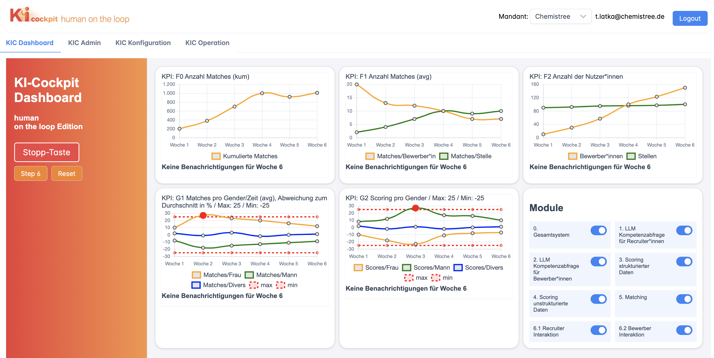

# CHEMISTREE AI Cockpit

This AI cockpit prototype is the result of the research project “KI-Cockpit”, partly funded by the German Ministry of Labour and Social Affairs, 2023-2025.  

It aims at assisting those who are assigned the role of “human oversight” under the AI Act to effectively monitor and control an AI system.

For more details on the research project see: https://www.kicockpit.eu/.

CHEMISTREE initiated the research project and developed an AI cockpit version for “humans on the loop”.  

CHEMISTREE provides matching solutions for HR, for example for recruiting. For more background on CHEMISTREE, see http://www.chemistree.de.

As recruiting is a high risk field under the AI Act, special care has to be taken regarding fairness, transparency and reasoning. Therefore, recruiting AI needs an AI cockpit. For more background on how this works in practice, see our showcase applications on https://ki-cockpit.eu/

For further results that were developed in the research project, also check out https://github.com/KI-Cockpit.

Legend: "KI" is the short term for "Künstliche Intelligenz" (Artifical Intelligence).

## Architecture
For details on the domain stories and functionality of the AI Cockpit see [technical documentation](https://github.com/chmstr/ai-cockpit/blob/main/docu/index.md) 

## Installation 
For details on how to build and run the AI Cockpit see [development instructions](https://github.com/chmstr/ai-cockpit/blob/main/docu/install.md).

## Licence
Software in this repository is licensed under the AGPL-3.0 license. See [license agreement](https://github.com/chmstr/ai-cockpit/blob/main/LICENSE) for more details.