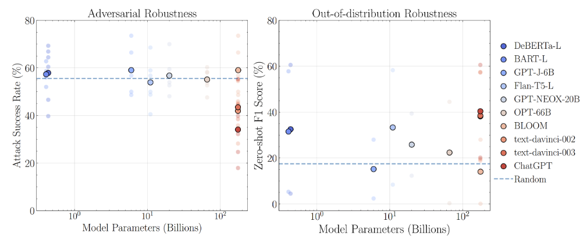

# Betriebsanleitung gemäß EU AI-Act (Artikel 13) für die Chemistree Matching Software

- [Betriebsanleitung gemäß EU AI-Act (Artikel 13) für die Chemistree Matching Software](#betriebsanleitung-gemäß-eu-ai-act-artikel-13-für-die-chemistree-matching-software)
  - [Transparenz und Bereitstellung von Informationen für die Betreiber](#transparenz-und-bereitstellung-von-informationen-für-die-betreiber)
  - [Kontaktdaten des Anbieters (3a)](#kontaktdaten-des-anbieters-3a)
  - [Merkmale, Fähigkeiten und Leistungsgrenzen des Hochrisiko-KI-Systems(3b)](#merkmale-fähigkeiten-und-leistungsgrenzen-des-hochrisiko-ki-systems3b)
    - [Merkmale](#merkmale)
    - [Fähigkeiten](#fähigkeiten)
    - [Leistungsgrenzen](#leistungsgrenzen)
  - [Zweckbstimmung (3b.i)](#zweckbstimmung-3bi)
  - [Genauigkeit, Robustheit und Cybersicherheit (3b.ii)](#genauigkeit-robustheit-und-cybersicherheit-3bii)
    - [Genauigkeit](#genauigkeit)
    - [Robustheit](#robustheit)
    - [Cybersicherheit](#cybersicherheit)
  - [Umstände bezüglich der Verwendung (3b.iii)](#umstände-bezüglich-der-verwendung-3biii)
    - [Allgemeine Risikoeinschätzung](#allgemeine-risikoeinschätzung)
    - [Anwendungsspezifische Risiken im regulären Betrieb](#anwendungsspezifische-risiken-im-regulären-betrieb)
    - [Risiken bei vorhersehbarem Missbrauch](#risiken-bei-vorhersehbarem-missbrauch)
  - [Hilfen zur Erläuterung der Ausgaben des Systems (3b.iv)](#hilfen-zur-erläuterung-der-ausgaben-des-systems-3biv)
  - [Besondere Leistungsangaben in Bezug auf Personen oder Personengruppen (3b.v)](#besondere-leistungsangaben-in-bezug-auf-personen-oder-personengruppen-3bv)
  - [Spezifikation für Eingabedaten (3b.vi)](#spezifikation-für-eingabedaten-3bvi)
  - [Angaben zur Interpretierbarkeit der Ausgaben (3b.vii)](#angaben-zur-interpretierbarkeit-der-ausgaben-3bvii)
  - [Angaben zur Versionierung der Änderungen (3c)](#angaben-zur-versionierung-der-änderungen-3c)
  - [Gewährleistung der menschlichen Aufsicht (3d)](#gewährleistung-der-menschlichen-aufsicht-3d)
  - [Erforderliche Rechen- und Hardware-Ressourcen (3e)](#erforderliche-rechen--und-hardware-ressourcen-3e)
  - [Protokollerfassung gemäß Artikel 12 (3f)](#protokollerfassung-gemäß-artikel-12-3f)

## Transparenz und Bereitstellung von Informationen für die Betreiber

> (1)   Hochrisiko-KI-Systeme werden so konzipiert und entwickelt, dass ihr Betrieb hinreichend transparent ist, damit die Betreiber die Ausgaben eines Systems angemessen interpretieren und verwenden können. Die Transparenz wird auf eine geeignete Art und in einem angemessenen Maß gewährleistet, damit die Anbieter und Betreiber ihre in Abschnitt 3 festgelegten einschlägigen Pflichten erfüllen können.

> (2)   Hochrisiko-KI-Systeme werden mit Betriebsanleitungen in einem geeigneten digitalen Format bereitgestellt oder auf andere Weise mit Betriebsanleitungen versehen, die präzise, vollständige, korrekte und eindeutige Informationen in einer für die Betreiber relevanten, barrierefrei zugänglichen und verständlichen Form enthalten.

## Kontaktdaten des Anbieters (3a)

> (3) Die Betriebsanleitungen enthalten mindestens folgende Informationen: den Namen und die Kontaktangaben des Anbieters sowie gegebenenfalls seines Bevollmächtigten

Chemistree GmbH\
Hohenadlstraße 4\
85737 Ismaning

Mail: <support@chemistree.de>\
Telefon: 089 455 646 54\
Geschäftsführung: Rosmarie Steininger

## Merkmale, Fähigkeiten und Leistungsgrenzen des Hochrisiko-KI-Systems(3b)

> (3) a) Die Betriebsanleitungen enthalten mindestens folgende Informationen: die Merkmale, Fähigkeiten und Leistungsgrenzen des Hochrisiko-KI-Systems

### Merkmale

- Matching-Algorithmen: Das System verwendet deterministische Algorithmen zur Bestimmung des besten Matchingpaars von Mensch + Mensch, oder Mensch + Stelle
  
- Automatisierte Berichterstellung: Durch den Why-we-match-Bericht erfahren Benutzer, warum sie zu einer bestimmten Stelle matchen.

- [Verlinkung zu dem Fragebogen (Input-Daten) + Matching-Regeln]

### Fähigkeiten

- Zeitersparnis: Durch das automatisierte Matching verkürzt das System die Zeit, die besten Matchingpaare zu finden
  
- Anpassungsfähigkeit: Der Fragebogen zum Ausfüllen aller Attribute kann individuell angepasst und gewichtet werden.

### Leistungsgrenzen

- Nur Vorschläge mit Veto-Möglichkeit, aber kein vollautomatischer Vertragsabschluss
  
- kein Erkennen von absichtlich falsch ausgefüllten Profilen

## Zweckbstimmung (3b.i)

> (3) b) i) Die Betriebsanleitungen enthalten mindestens folgende Informationen: Zweckbestimmung

Den richtigen Job für Bewerbende finden und die richtigen Bewerbenden für einen Job finden: Optimale Jobmatches mit Hilfe von Auswahlmöglichkeiten bei passenden Kriterien.
Bewerbende wissen, welchen Job sie gerne hätten. Stellenanbietende wissen, welche Bewerbenden sie gerne hätten. Beide Seiten brauchen die Möglichkeit, die für sie relevanten Kriterien anzugeben. Und sie brauchen Hilfe dabei, aus einer Vielzahl von Möglichkeiten die Kriterien zu ermitteln, die für sie am besten passen. Dies bietet die CHEMISTREE Jobmatch-Plattform. Sie hat das Ziel, optimale Matches vorzuschlagen.
Optimales Matching bedeutet für uns, dass beide Seiten das Match bekommen, das für sie ganz persönlich am besten passt:

1. Es nimmt den ganzen Menschen in den Blick und nicht nur einen standardisierten Lebenslauf.

2. Es bezieht die künftigen Entwicklungswünsche ein und nicht nur das, was in der Vergangenheit war.

3. Es ist individuell optimal, manchmal vielleicht überraschend, und sortiert keine Menschen aus den falschen Gründen aus.

## Genauigkeit, Robustheit und Cybersicherheit (3b.ii)

> (3) b) ii) des Maßes an Genauigkeit — einschließlich diesbezüglicher Metriken —, Robustheit und Cybersicherheit gemäß Artikel 15, für das das Hochrisiko-KI-System getestet und validiert wurde und das zu erwarten ist, sowie aller bekannten und vorhersehbaren Umstände, die sich auf das erwartete Maß an Genauigkeit, Robustheit und Cybersicherheit auswirken können;

### Genauigkeit

Die Genauigkeit hängt ab von dem Betriebsmodus, in dem das System betrieben wird, von denen sich zwei unterscheiden lassen:

1. Ausschließlich deterministischer Modus
Der verwendete Algorithmus hat 100% Genauigkeit (Accurary) weil er als transparent und deterministisch ist: Kriterien wurden durch Expert:innen gesetzt und der Algorithmus weicht nicht von den gesetzten Kriterien ab.

1. Nutzung von Large Language Models (ChatGPT)
ChatGPT-4o ist laut dem Massive Multi-task Language Understanding (MMLU) in 88,7 % der Fälle korrekt. Die Genauigkeit kann durch projektspezifisch angepasstes LLM Optimierung (Prompt Engineering) und durch Context Optimierung für den konkreten Anwendungsfall deutlich höher ausfallen.

### Robustheit

Die Robustheit hängt ab von dem Betriebsmodus:

1. Ausschließlich deterministische Algorithmen:
   - Robustheit beim Scoring-Modul: Ein feindlicher Angriff erzeugt Unsinn im eigenen Profil, aber hat keine Konsequenzen für anderen oder alle Teilnehmer. Es gibt zudem keine Ergebnisfluktuation.
   - Robustheit beim Matching-Modul: Es gibt gesamtheilich keine Ergebnisfluktuation.

2. LLM-Modul
Die Robustheit von ChatGPT muss differenziert bewertet werden, siehe dazu folgende Studien mit den entsprechenden Metriken für "adversarial and Out-of-distribution Robustness" :

- <https://arxiv.org/abs/2302.12095>
- <https://microsoft.github.io/robustlearn/chatgpt-robust/>

### Cybersicherheit

Die Cybersicherheit entspricht der Angaben im folgenden Dokument:

- [Verweis auf Chemistree IT-Securiy-Richtlinien Dokumentation]

## Umstände bezüglich der Verwendung (3b.iii)

> (3) b) iii) aller bekannten oder vorhersehbaren Umstände bezüglich der Verwendung des Hochrisiko-KI-Systems im Einklang mit seiner Zweckbestimmung oder einer vernünftigerweise vorhersehbaren Fehlanwendung, die zu den in Artikel 9 Absatz 2 genannten Risiken für die Gesundheit und Sicherheit oder die Grundrechte führen können,

### Allgemeine Risikoeinschätzung

Allgemeine Risiken sind formuliert in folgendem Dokument:

- [Link zum Chemistree Risiko-Management-Dokument]

### Anwendungsspezifische Risiken im regulären Betrieb

- Risiko: Diskriminierung nach Geschlecht
- Maßnahmen zur Risikominderung: Überwachung der Verteilung nach Geschlecht durch KPI-Messung und Transparenz im KI-Cockpit

### Risiken bei vorhersehbarem Missbrauch

- Risiko: Administrativer Missbrauch durch Ausschluss von Personengruppen über Attributfilter
- Maßnahmen zur Risikominderung: Offenlegung der Kriterien und Einstellung (Chemistree gegenüber Betreiber)

## Hilfen zur Erläuterung der Ausgaben des Systems (3b.iv)

> (3) b) iv) gegebenenfalls der technischen Fähigkeiten und Merkmale des Hochrisiko-KI-Systems, um Informationen bereitzustellen, die zur Erläuterung seiner Ausgaben relevant sind;

Das Matching-Modul verfügt über eine why-we-match-Erklärungstext, welcher die Gründe für den Match transparent machen kann.

## Besondere Leistungsangaben in Bezug auf Personen oder Personengruppen (3b.v)

> (3) b) v) gegebenenfalls seiner Leistung in Bezug auf bestimmte Personen oder Personengruppen, auf die das System bestimmungsgemäß angewandt werden soll;

n.a.

## Spezifikation für Eingabedaten (3b.vi)

> (3) b) vi) gegebenenfalls der Spezifikationen für die Eingabedaten oder sonstiger relevanter Informationen über die verwendeten Trainings-, Validierungs- und Testdatensätze, unter Berücksichtigung der Zweckbestimmung des Hochrisiko-KI-Systems;

Chemistree selbst verwendet keine eigenen Trainings-, Validierungs- und Testdatensätze.

## Angaben zur Interpretierbarkeit der Ausgaben (3b.vii)

> (3) b) vii) gegebenenfalls Informationen, die es den Betreibern ermöglichen, die Ausgabe des Hochrisiko-KI-Systems zu interpretieren und es angemessen zu nutzen;

Chemistree verwendet das KI-Cockpit, die es dem KIC-Operator als Human-in-Command die Möglichkeit gibt, alle relevanten Ausgaben über KPIs und Testfälle zu beobachten, zu beurteilen und entsprechenden Maßnahmen gemäß Artikel 14 zu treffen (z.B. Stopptaste).

## Angaben zur Versionierung der Änderungen (3c)

> (3) c) etwaige Änderungen des Hochrisiko-KI-Systems und seiner Leistung, die der Anbieter zum Zeitpunkt der ersten Konformitätsbewertung vorab bestimmt hat;

Chemistree stellt bei jedem Release-Wechsel die Informationen über die Versionsupdates bereit.

## Gewährleistung der menschlichen Aufsicht (3d)

> (3) d) die in Artikel 14 genannten Maßnahmen zur Gewährleistung der menschlichen Aufsicht, einschließlich der technischen Maßnahmen, die getroffen wurden, um den Betreibern die Interpretation der Ausgaben von Hochrisiko-KI-Systemen zu erleichtern;

Die menschliche Aufsicht wird durch die Benutzung des KI-Cockpits sichergestellt, in dem folgende KPIs überwacht werden:

- KPI 1: Anzahl Matches pro Frau / pro Mann /  pro divers (// pro Altersgruppe)

- KPI 2: Anteil von Frauen mit Match / Anteil von Frauen auf Plattform

## Erforderliche Rechen- und Hardware-Ressourcen (3e)

> (3) e) die erforderlichen Rechen- und Hardware-Ressourcen, die erwartete Lebensdauer des Hochrisiko-KI-Systems und alle erforderlichen Wartungs- und Pflegemaßnahmen einschließlich deren Häufigkeit zur Gewährleistung des ordnungsgemäßen Funktionierens dieses KI-Systems, auch in Bezug auf Software-Updates;

- Rechen- und Hardware-Ressourcen:
  - deterministischer Betriebsmodus: sehr ressourcenschonend
  - LLM-Modus: nur optional für externe Anfrage nötig und daher verhältnismäßig gering
- erwartete Lebensdauer: bei regelmäßiger Inspektion unbegrenzt
- Wartungs- und Pflegemaßnahmen:
  - regelmäßige Überprüfung der Kriterien aufgrund der Veto-Gründe
  - regelmäßig Löschkonzept für inaktive Profile

## Protokollerfassung gemäß Artikel 12 (3f)

> (3) f) gegebenenfalls eine Beschreibung der in das Hochrisiko-KI-System integrierten Mechanismen, die es den Betreibern ermöglicht, die Protokolle im Einklang mit Artikel 12 ordnungsgemäß zu erfassen, zu speichern und auszuwerten.

Folgende Protokoll- und Logdaten werden erfasst:

- Log aller Matches incl. why-we-match
- Log aller Stati-Änderungen
- Log der KPIs und Testfälle im KIC
