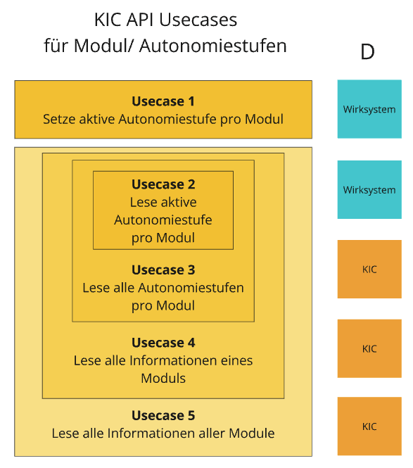

# KI-Cockpit (human on the loop) - Technisches Konzept

__Inhaltsverzeichnis der KI-Cockpit Dokumentation__

- [KI-Cockpit (human on the loop) - Technisches Konzept](#ki-cockpit-human-on-the-loop---technisches-konzept)
- [Idee zum KI-Cockpit](#idee-zum-ki-cockpit)
- [KI-Cockpit und EU-AI Act](#ki-cockpit-und-eu-ai-act)
- [Domain Stories](#domain-stories)
  - [DS1: System stoppen durch Drücken der Stopp-Taste](#ds1-system-stoppen-durch-drücken-der-stopp-taste)
  - [DS2: System starten durch Drücken der Start-Taste](#ds2-system-starten-durch-drücken-der-start-taste)
  - [DS3: Ändern der Autonomiestufe eines KI-Systems](#ds3-ändern-der-autonomiestufe-eines-ki-systems)
  - [DS4: Ändern der Autonomiestufe eines Moduls eines KI-Systems](#ds4-ändern-der-autonomiestufe-eines-moduls-eines-ki-systems)
  - [DS5: Beobachten von spezifischen Messwerten des KI-Systems](#ds5-beobachten-von-spezifischen-messwerten-des-ki-systems)
  - [DS6: Senden von Alarmierungen für spezifischen Messwerte des KI-Systems](#ds6-senden-von-alarmierungen-für-spezifischen-messwerte-des-ki-systems)
  - [DS7: Es kann ein Risikoprofil erstellt werden und mit KPIs verknüpft werden, dass Auskunft über den tatsächlich Risikofall gibt](#ds7-es-kann-ein-risikoprofil-erstellt-werden-und-mit-kpis-verknüpft-werden-dass-auskunft-über-den-tatsächlich-risikofall-gibt)
  - [Übersicht über die Domain-Stories](#übersicht-über-die-domain-stories)
  - [Übersicht über weitere mögliche Domain Stories im KI-Cockpit](#übersicht-über-weitere-mögliche-domain-stories-im-ki-cockpit)
- [Domain-Objekte](#domain-objekte)
  - [Module](#module)
    - [Beispiel: HR-Software](#beispiel-hr-software)
    - [Beispiel: Verkehrsüberwachung](#beispiel-verkehrsüberwachung)
    - [Beispiel: Spracherkennung](#beispiel-spracherkennung)
  - [Autonomiestufen](#autonomiestufen)
    - [Unterscheidung zwischen Autonomiestufen und Automatisierungsgraden](#unterscheidung-zwischen-autonomiestufen-und-automatisierungsgraden)
  - [Risiken](#risiken)
  - [Maßnahmen](#maßnahmen)
- [KI-Cockpit und KIC-API](#ki-cockpit-und-kic-api)
  - [Konfiguration des KI-Cockpits](#konfiguration-des-ki-cockpits)
  - [Betrieb eines KI-Cockpits](#betrieb-eines-ki-cockpits)
  - [Übersicht: Relevante API-Usecases während der Konfiguration und im Betrieb](#übersicht-relevante-api-usecases-während-der-konfiguration-und-im-betrieb)
  - [Sinn und Zweck einer KIC-API](#sinn-und-zweck-einer-kic-api)
  - [Zum aktuellen Stand der KIC-API](#zum-aktuellen-stand-der-kic-api)
- [KIC API-Usecases für Autonomiestufen und Module](#kic-api-usecases-für-autonomiestufen-und-module)
  - [API-Usecase 1 \& 2: Setze und lese aktive Autonomiestufe pro Modul](#api-usecase-1--2-setze-und-lese-aktive-autonomiestufe-pro-modul)
    - [Herausforderung bei mehrer unabhängigen Modulen](#herausforderung-bei-mehrer-unabhängigen-modulen)
  - [API-Usecase 3: Alle Autonomiestufen eines Moduls abfragen](#api-usecase-3-alle-autonomiestufen-eines-moduls-abfragen)
    - [Herausforderung: alle KIC spezifischen Zusatzinfos direkt im Wirksystem implementieren?](#herausforderung-alle-kic-spezifischen-zusatzinfos-direkt-im-wirksystem-implementieren)
      - [Beispiel 1: Alles im Wirksystem](#beispiel-1-alles-im-wirksystem)
      - [Beispiel 2: Zwei verschiedene Systeme](#beispiel-2-zwei-verschiedene-systeme)
      - [Beispiel 3: Alles im KIC-Service](#beispiel-3-alles-im-kic-service)
  - [API-Usecase 4: Alle Informationen eines Moduls abfragen](#api-usecase-4-alle-informationen-eines-moduls-abfragen)
  - [API-Usecase 5: Alle Informationen aller Module abfragen](#api-usecase-5-alle-informationen-aller-module-abfragen)
  - [Zusammenfassung: Die KIC-API-Usecases in der Übersicht](#zusammenfassung-die-kic-api-usecases-in-der-übersicht)
- [Vor- und Nachteile der Implementierungs-Szenarios](#vor--und-nachteile-der-implementierungs-szenarios)
  - [Alle API-Usecases im Wirksystem implementiert](#alle-api-usecases-im-wirksystem-implementiert)
  - [Alle API-Usecases im KI-Cockpit implementiert](#alle-api-usecases-im-ki-cockpit-implementiert)
  - [Mittelweg: Teils im Wirksystem, Teils im KIC](#mittelweg-teils-im-wirksystem-teils-im-kic)
  - [Hybridlösung: Sowohl im Wirksystem als auch im KI-Cockpit](#hybridlösung-sowohl-im-wirksystem-als-auch-im-ki-cockpit)
    - [Ablaufdiagramm: KIC-User lädt alle Modul-Infos](#ablaufdiagramm-kic-user-lädt-alle-modul-infos)
    - [Ablaufdiagramm: KIC-User lädt jedes Modul einzeln](#ablaufdiagramm-kic-user-lädt-jedes-modul-einzeln)
    - [Ablaufdiagramm: KIC-API-Service](#ablaufdiagramm-kic-api-service)
    - [Ablaufdiagramm: Komplettes Bild](#ablaufdiagramm-komplettes-bild)
- [Integrationspfade](#integrationspfade)
  - [Integrationspfad 1: Schmidt GmbH](#integrationspfad-1-schmidt-gmbh)
    - [1. Wirksystem: aktive Autonomiestufe lesen und schreiben](#1-wirksystem-aktive-autonomiestufe-lesen-und-schreiben)
    - [2. Wirksystem: alle Autonomiestufen lesen](#2-wirksystem-alle-autonomiestufen-lesen)
    - [3. KIC: Alle Module konfigurieren](#3-kic-alle-module-konfigurieren)
    - [4. KIC: Alle Autonomiestufen pro Modul ins KIC importieren](#4-kic-alle-autonomiestufen-pro-modul-ins-kic-importieren)
    - [5. KIC: Der KIC-Operator reichert die Autonomiestufen an](#5-kic-der-kic-operator-reichert-die-autonomiestufen-an)
    - [6. KIC: Der KIC-Operator behält die Übersicht](#6-kic-der-kic-operator-behält-die-übersicht)
  - [Integrationspfad 2: Huber GmbH](#integrationspfad-2-huber-gmbh)
    - [1. Wirksystem: Aktive Autonomiestufe setzen und lesen](#1-wirksystem-aktive-autonomiestufe-setzen-und-lesen)
    - [2. Wirksystem: UI zur Änderung der Autonomiestufen entsteht](#2-wirksystem-ui-zur-änderung-der-autonomiestufen-entsteht)
    - [3. KIC wird zur Dokumentation genutzt](#3-kic-wird-zur-dokumentation-genutzt)
    - [4. Gen-KIC + Wirksystem: KIC-Operator kann Autonomiestufe im Wirksystem lesen und ändern](#4-gen-kic--wirksystem-kic-operator-kann-autonomiestufe-im-wirksystem-lesen-und-ändern)
  - [Integrationspfad 3: Maier GmbH](#integrationspfad-3-maier-gmbh)
    - [1. Wirksystem: Aktive Autonomiestufe setzen und lesen](#1-wirksystem-aktive-autonomiestufe-setzen-und-lesen-1)
    - [2. KIC: Module und Autonomiestufen werden konfiguriert](#2-kic-module-und-autonomiestufen-werden-konfiguriert)
    - [3. KIC: KIC-Operator kann Autonomiestufen ändern](#3-kic-kic-operator-kann-autonomiestufen-ändern)
- [KIC API-Usecases für KPIs](#kic-api-usecases-für-kpis)
- [KIC API-Usecases für Testfälle](#kic-api-usecases-für-testfälle)
- [Alternative zum KI-Cockpit oder KIC-API: Nutzung der Domainstories und Domainobjekte](#alternative-zum-ki-cockpit-oder-kic-api-nutzung-der-domainstories-und-domainobjekte)
- [Glossar](#glossar)

# Idee zum KI-Cockpit

Das KI-Cockpit ist entstanden als Antwort auf die Frage, wie es Menschen gelingen kann den Überblick über die Steuerung und den Betrieb von komplexen KI-Systemen zu behalten, die als riskant eingestuft werden.

Das KI-Cockpit ist gedacht als ein Werkzeug zur Steuerung und Kontrolle von KI-Systemen.

# KI-Cockpit und EU-AI Act

Das KI-Cockpit soll helfen folgende Anforderungen des EU AI Acts umzusetzen:

  > (4)   Für die Zwecke der Durchführung der Absätze 1, 2 und 3 wird das Hochrisiko-KI-System dem Betreiber so zur Verfügung gestellt, dass die natürlichen Personen, denen die menschliche Aufsicht übertragen wurde, angemessen und verhältnismäßig in der Lage sind, [...]
  >
  > - d) in einer bestimmten Situation zu beschließen, das Hochrisiko-KI-System nicht zu verwenden oder die Ausgabe des Hochrisiko-KI-Systems außer Acht zu lassen, außer Kraft zu setzen oder rückgängig zu machen;
  >
  > - e) in den Betrieb des Hochrisiko-KI-Systems einzugreifen oder den Systembetrieb mit einer „Stopptaste“ oder einem ähnlichen Verfahren zu unterbrechen, was dem System ermöglicht, in einem sicheren Zustand zum Stillstand zu kommen.

Es stellt sich also die Herausforderungen, wie es Personen (dem Human in Command) gelingen kann, in den Betrieb eines KI-System einzugreifen bzw. den Systembetrieb mit einer "Stopptaste" zu unterbrechen.

Das KI-Cockpit soll dafür eine technische Lösung sein, die genau dieser Herausforderung gerecht wird, und bietet die Möglichkeit dass der Human-in-Command

- in den Betrieb eines KI-Systems eingreifen kann
- den Systembetrieb mit einer "Stopptaste" unterbrechen kann
- alle relevanten Informationen erhalten kann, um die Entscheidung für einen Eingriff zu haben.

# Domain Stories

Um den Anforderungen aus Artikel 14 gerecht zu werden, müssen Domain Stories abgeleitet werden, welche die konkreten Aktivitäten beschreiben, die ein Nutzer in einem KI-Cockpit durchgeführen kann.

## DS1: System stoppen durch Drücken der Stopp-Taste

> Der KIC-User drückt die Stopptaste im KI-Cockpit, was dem KI-System ermöglicht "... in einem sicheren Zustand zum Stillstand zu kommen" (Artikel 14.4e).

Die Schritte im einzelnen sind:

1. User drückt Stopp-Taste im KI-Cockpit
2. KI-Cockpit sendet Stopp-Singal an das KI-System
3. KI-System kommt in einem sicheren Zustand zum Stillstand
4. KI-System meldet den sicheren Zustand ans KI-Cockpit
5. KI-Cockpit informiert den User über den sicheren Zustand des KI-Systems

## DS2: System starten durch Drücken der Start-Taste

Um sicherzustellen, dass der KIC-User auch die Möglichkeit hat, ein zum Stillstand gekommenes System wieder zu starten, sei folgende Domainstory formuliert:

> Der KIC-User drückt die Start-Taste im KI-Cockpit, um ein zum Stillstand gekommenes KI-System wieder neu zu starten.

Die Schritte im einzelnen sind:

1. User drückt Start-Taste im KI-Cockpit
2. KI-Cockpit sendet Start-Singal an das KI-System
3. KI-System wird gestartet
4. KI-System meldet den gestarten Zustand ans KI-Cockpit
5. KI-Cockpit informiert den User über den gestarteten Zustand des KI-Systems

## DS3: Ändern der Autonomiestufe eines KI-Systems

> Ein User ändert im KI-Cockpit die Autonomiestufe eines Systems um zu erreichen, dass das System mit mehr oder weniger Autonomie agiert.

Die Schritte im einzelnen sind:

1. User wählt im KI-Cockpit für ein KI-System eine bestimmte Autonomiestufe aus
2. Die Änderung der Autonomiestufe wird an das KI-System gesendet
3. Das KI-System ändert seine Autonomiestufe
4. Das KI-System meldet die erfolgreich durchgeführte Änderung der Autonomiestufe an das KI-Cockpit
5. Das KI-Cockpit informiert den User über die erfolgreich druchgeführte Änderung der Autonomiestufe

## DS4: Ändern der Autonomiestufe eines Moduls eines KI-Systems

Häufig kommt es vor, dass größere IT-Systeme aus mehreren einzelnen Komponenten bestehen, die voneinander unterschieden werden können. Je nach Kontext können diese einzelnen Komponenten eines Systems unterschiedlich bezeichnet werden, wie z.B. als Module, Funktionen, Services etc. Diese strukturelle oder funktionale Modularisierung von großen IT-Systemen macht aus mehreren Gründen Sinn, vorallem aber um die Komplexität des Gesamtsystems zu reduzieren und die Wiederverwendbarkeit der einzelnen Komponenente zu erhöhen. Die zugrundeliegende Design-Prinzipien werden in der Informatik wie folgt bezeichnet:

- "Seperation of Concerns (SoC)", das man mit "Funktionale Trennung" übersetzen könnte.
- "Single Responsibility", dass übersetzt werden kann als "Prinzip der eindeutigen Verantwortlichkeit".

Um dieser Gegebenheit der Modularisierung in größeren IT-Systemen zu berücksichtigen, soll im KI-Cockpit die Änderung von Autonomiestufen nicht nur für das Gesamtystem, sondern auch für einzelne Komponenten angewendet werden können.

Die zugehörige Domainstory lautet daher in leichter Abwandlung zur vorherigen:

> Ein User ändert im KI-Cockpit die Autonomiestufe eines einzelnen Moduls des Gesamtsystem um zu erreichen, dass das betreffende Modul im Gesamtsystem mit mehr oder weniger Autonomie agiert.

## DS5: Beobachten von spezifischen Messwerten des KI-Systems

> Ein User möchte wichtige Messwerte des KI-System grafisch dargestellt haben, um festzustellen, ob ein Eingriff in das KI-System nötig ist.

Die Entscheidung über den Eingriff in ein KI-System wie das Drücken der Stopp-Taste oder Ändern von Autonomiestufen einzelner Module sind nur dann zuverlässig zu treffen, wenn es aussagekräfte Messwerte (KPI: Key Performance Indikatoren) über das KI-System gibt, die verständlich aufbereitet sind.

Um diese Messwerte darzustellen und bereitzustellen sind folgende Schritte nötig:

1. Ausgangspunkt: User möchte spezifische Messwerte des KI-System beobachten
2. Das KI-Cockpit sendet dazu eine Anfrage ans KI-System
3. Das KI-System berechnet oder liest die bereits vorhandenen internen Messwerte aus
4. Das KI-System sendet eine Liste von Messwerten an das KI-Cockpit
5. Das KI-Cockpit bereitet die Messwerte so auf, dass sie verständlich grafisch als Diagramm dargestellt werden.

## DS6: Senden von Alarmierungen für spezifischen Messwerte des KI-Systems

> Ein User möchte automatisch Benachrichtungen erhalten, wenn wichtige Messwerte des KI-System nicht im definierten im Normbereich sind.

Um jederzeit auf kritische Änderungen von Messwerte reagieren zu können, soll der User aktiv benachrichtigt werden, wenn bestimmte Messwerte des KI-Systems nicht im Normbereich sind. Dazu kann der User pro KPI einen Minimal und Maximal-Wert definieren, der auch grafisch dargestellt wird.

Die einzelnen Schritte sind:

1. Ausgangspunkt: Der User möchte Benachrichtungen erhalten, wenn bestimmte Messwerte nicht im Normbereich sind. Dazu definiert er einen Minimal- und Maximal-Wert pro Messwert.
2. Das KI-Cockpit sendet eine Anfrage ans KI-System zu den spezifischen Werten
3. Das KI-System ruft die internen Messwerte ab
4. Das KI-Cockpit sendet die Messwerte an das KI-Cockpit
5. Das KI-Cockpit erkennt eine Unter- oder Überschreitung der Normwerte und sendet eine sprechende Benachrichtung an den User. Zudem wird die Unter- oder Überschreitung der Normwerte im KI-Cockpit grafisch angezeigt.

## DS7: Es kann ein Risikoprofil erstellt werden und mit KPIs verknüpft werden, dass Auskunft über den tatsächlich Risikofall gibt

> Ein User möchte die KPIs mit Risiken verknüpfen, um zu erkennen, welche Risiken betroffen sind, wenn die KPIs nicht im Normbereich sind.
>

Um für das KI-System sinnvolle Messwerte zu definieren, ist es sinnvoll zunächst Risiken für das KI-System zu definieren, und diese den KPIs zuzuordnen, damit bei einer Über- und Unterschreitung von Messwerten, automatisch das Risikoprofil aktualisiert wird.

Die einzelnen Schritt sind:

1. Ausgangspunkt: Der User möchte mögliche Risiken des KI-System einschätzen, und damit die KPIs risikobasiert zu definieren und zu verknüpfen.
2. Das KI-Cockpit erlaubt es, spezifische Risiken für bestimmte Module des KI-Systems zu definieren, und stellt daszu eine Benutzeroberfläche zur Verfügung. Auch können diese Risiken mit KPIs verknüpft werden.
3. Das KI-Cockpit kann Auskunft geben, welche Auswirkungen die Unter- oder Überschreitung von Grenzwerten von KPIs für die Risikowahrscheinlichkeit hat, und kann dazu Benachrichtigungen versenden.

## Übersicht über die Domain-Stories

DS1: System stoppen durch Drücken der Stopp-Taste

DS2: System starten durch Drücken der Start-Taste

DS3: Ändern der Autonomiestufe eines Systems

DS4: Ändern der Autonomiestufe eines Moduls eines Systems

DS5: Beobachten von spezifischen Messwerten des KI-Systems

DS6: Senden von Alarmierungen für spezifischen Messwerte des KI-Systems

DS7: Es kann ein Risikoprofil erstellt werden und mit KPIs verknüpft werden, dass Auskunft über den tatsächlich Risikofall gibt.

## Übersicht über weitere mögliche Domain Stories im KI-Cockpit

Im Laufe des KIC-Projktes sind viele weitere Ideen für Domainstories enstanden, die alle in weiteren Versionen des KI-Cockpites implementiert werden können und hierfür eine mögliche zukünftige Realisierung festgehalten werden sollen:

# Domain-Objekte

## Module

Wie oben erläutert bestehen Software-Systeme und damit auch KI-Systeme aus mehreren fachlich abgrenzbaren Modulen, Komponenten oder funktionalen Bausteinen, die man unterscheiden möchte, da sie verschiedene Eingeschaften, wie mögliche Autonomiestufen und oder auch Risiken haben. Diese einzelnen Komponenten eines Software-Systems werden im folgenden einheitlich als Module bezeichnet. Nicht immer sind alle Module einer KI-basierten Software eindeutig selbst KI-Module, so dass man zwischen KI-Modulen und klassischen Software-Module unterscheiden könnte.

Es lassen sich diese Module bzw. Komponenten eines KI-Systems verschieden kategorisieren.

Denkbar wäre eine Einteilung nach dem Ablauf der Informationsverarbeitung:

- Information Acquisition (Informationsbeschaffung)
- Information Analysis (Informationsanalyse)
- Decision and Action Selection: Auswahl von Entscheidungen und Maßnahmen
- Action Implementation: Durchführung der Maßnahme

### Beispiel: HR-Software

Eine mögliche Modul-Aufteilung für eine Human-Ressources-Lösung, welche das Matching von Bewerbenden auf Stellen unterstützt, könnte sein:

- Datenerfassung mit manuellen User-Antworten
- Scoring der manuellen User-Antworten
- Datenerfassung mit KI-generierten Antwortoptionen
- Scoring der Auswahl von KI-generierten Antwortoptionen
- Algorithmische Matching-Pair-Berechnung
- Speicherung der Matching-Pairs
- Automatischer Versand der Matching-Pairs

Ordnet man die Module in einer logischen Abfolge an und gruppiert man diese entsprechend, dann erhält man folgende Übersicht:

### Beispiel: Verkehrsüberwachung

Für eine Software, die den Verkehrsfluss analysiert und automatische Reaktionen auslösen kann, könnten folgende Prozess-Schritte relevant sein:

- Sensoren bzw. Kameras
- Datenpipeline: klassisch
- Sensorik: KI in Form von Objekterkennung
- Entscheidungskomponente: klassich
- Aktorik bzw. Steuerung: klassisch
- Aktor

Hier könnte folgende Kategorisierung der Module Sinn machen:

- Aquisition: Sensoren und Datenpipline
- Analysis: Objekterkennung und Situationsbewertung
- Decision: Entscheidung über Eingriff in der Verkehrsfluss
- Action: Senden von Nachrichten an die Verkehrsüberwachung bzw. Ampelsteuerung

### Beispiel: Spracherkennung

Für eine Software, die über Spracherkennung bei bestimmten Ereignissen definierte Reaktionen auslöst, könnte die Aufteilung wie folgt sein:

- Speech2Text: Umwandlung von Sprache in Text
- Text2Event: Erkennung eines Sachverhaltes, wie z.B. eines bestimmten Ereignisses aus einer textuellen Beschreibung
- Event2Reaction: Auslösen bestimmter Reaktionen aufgrund eines definierten Ereignisses.

## Autonomiestufen

Autonomiestufen (Level of Autonomy, LoA) sind mögliche Betriebsmodi eines KI-Software-Moduls, wie z.B. die 5 Automatisierungsgrade des Autonomen Fahrens:

- Level 0: Keine Automatisierung
- Level 1: Assistiertes Fahren
- Level 2: Teilautomatisiertes Fahren
- Level 3: Hochautomatisiertes Fahren
- Level 4: Vollautomatisiertes Fahren
- Level 5: Autonomes Fahren

Im KI-Cockpit können für jedes Modul beliebig viele Autonomiestufen definiert werden, die sich pro Modul völlig unterscheiden können.

Für ein HR-Software als Ganzes, die beste Treffer zwischen Bewerber und Stellenangebot vorschlägt, wäre z.B. folgende Autonomiestunfen denkbar:

- Level 0: Manuelles Matching
- Level 1: Halbautomatisches Matching
- Level 2: Automatisches Matching

Für ein Software-Modul eines HR-Systems, dass LLM-Modelle nutzt um mögliche Kompetenzen aus einer Jobbeschreibung zu generieren, könnte man folgenden Autonomiestunfen unterscheiden:

- Level 0: Keine LLM-Abfrage
- Level 1: LLM-Abfrage mit Filter
- Level 2: LLM-Abfrage ohne Filter

### Unterscheidung zwischen Autonomiestufen und Automatisierungsgraden

Autonomiestufen und Automatisierungsgrade werden im KI-Cockpit synonym verwendet. Allerdings kann es in bestimmten Situationen auch Sinn machen, diese zu unterscheiden, um auf die Besonderheit von autonomen KI-Systemen hinzuweisen:

- Automatisierungsgrade: Fokus auf Aufgabenausführung – Maschinen übernehmen definierte Aufgaben nach programmierten Regeln.

- Autonomiestufen: Fokus auf Entscheidungsfähigkeit und Anpassung – Systeme treffen Entscheidungen selbstständig basierend auf Umgebungsdaten und lernen möglicherweise dazu.

Zusammengefassend: Automatisierung ist ein Schritt auf dem Weg zur Autonomie, aber Autonomie geht weiter, da sie Intelligenz und Eigenständigkeit einbezieht.

## Risiken

KI-Systeme werden gemäß AI-Act nach deren Risiken eingestuft. Es macht daher besonders Sinn, diese transparent zu machen und zu dokumentieren, welche Maßnahmen man unternommen hat, um die Eintrittswahrscheinlichkeit oder das Schadenspotential zu reduzieren. Daher bietet das KI-Cockpit die Möglichkeit, diese Risiken auch zu dokumentieren.

Risiken können nicht nur für das Gesamtsystem sondern auch für einzelne Module (bzw. Funktionen, Services) definiert werden. Für jedes Risiko können unterschiedliche Attribute definiert werden:

- Benennung und Beschreibung des Risikos
- Eintrittswahrscheinlichkeit (vor und nach Durchführung von Risiko-Maßnahmen)
- Schadenspotential (vor und nach Durchführung von Risiko-Maßnahmen)

## Maßnahmen

Um die Risiken zu managen unterscheidet das KI-Cockpit zwischen verschiedenen Maßnahmen:

- Testfälle: erlauben das automatische Ausführen von definierten Tests
- Messung von definierten Werten (Key Performance Indikatoren: KPIs)
- Automatischen Regeln, welche die automatische Ausführung von Testfällen und Messungen erlauben
- Sonstige Maßnahmen, die nur manuell durchgeführt und überprüft werden können

# KI-Cockpit und KIC-API

Ziel des KI-Cockpit ist es, eine prototypische Lösung Software-Lösung anzubieten, wie eine Person in der Rolle als Human-in-Command in den Betrieb eines KI-System eingreifen kann.

Dazu ist es erforderlich, dass diese Person die richtigen Mittel in die Hand bekommt, um seine Aufgabe bewältigen zu können. Dazu bietet sich das KI-Cockpit als beispielhafte Software-Lösung an, mit welcher der Human-in-Command das KI-System beobachten und aktiv eingreifen kann.

## Konfiguration des KI-Cockpits

Bevor das KI-Cockpit zur Kontrolle und Steuerung des KI-Wirksystems benutzt werden kann, muss es über alle technischen und fachlichen Informationen über das Wirksystem verfügen, die grundsätzlich auf zwei unterschiedlichen Wegen erhalten werden können:

- manuelle Eingabe der Informationen von einer Person (KIC-User) in das KI-Cockpit
- automatischer Import von Informationen vom KI-Wirksystem über die KIC-API in das KI-Cockpit

Es sind verschiedene Szenarien denkbar, welche Informationen der KIC-User manuell im KI-Cockpit erstellt und welche Informationen über die KIC-API automatisch aus dem Wirksystem geladen werden.

Folgendes Szenario soll veranschaulichen, welche Informationen auf welchem Weg ins KI-Cockpit gelangen könnten:

Denkbar sind beliebige weitere Szenarien, davon sicher auch die beiden Extremfälle:

- Primär KIC-API: möglich wäre, dass die KIC-API um viele Felder erweitert wird, so dass die manuelle Arbeit des KIC-Users auf ein Minimum reduziert wird, da fast alle Informationen automatisch vom Wirksystem importiert werden können. Hier bleibt natürlich offen, wie diese Informationen vom Wirksystem bereitgestellt werden, oder welche manuelle Arbeit im Wirksystem dann doch stattfindet.
- Primär KI-Cockpit: möglich wäre, dass ein Wirksystem keine oder nur ganz wenige Informationen über die KIC-API bereitstellt, und alle weiteren Informationen vom KIC-User im KI-Cockpit manuell eingepflegt werden müssen.

Weiter unten werden mehrere Szenarien im Detail vorgestellt und analysiert.

## Betrieb eines KI-Cockpits

Die KIC-API erfüllt im Betrieb des KI-Cockpits primär folgende Funktionen:

- Module und Autonomiestufen
  - Ändern der aktiven Autonomiestufe eines Moduls im Wirksystem (M1 Usecase)
- KPIs
  - Auslesen von KPI-Werten des Wirksystem (K1 Usecase)
- Testfälle
  - Ausführen von Testfällen im Wirksystem (T1 Usecase)

## Übersicht: Relevante API-Usecases während der Konfiguration und im Betrieb

Fügt man den Zwischenschritt der manuellen Konfiguration hinzu, entsteht folgender Workflow von der automatischen Konfiguration per KIC-API, über die manuelle Konfiguration durch den KIC-User hin zum halbautomatischen Betrieb mit der KIC-API und dem manuellen Eingriff des KIC-Users:

## Sinn und Zweck einer KIC-API

Der Sinn einer KIC-API besteht aber nicht nur darin, den KIC-User von einer manuellen Anlage und Pflege im KI-Cockpit zu entlasten, in dem diese Daten über die KIC-API direkt ins KI-Cockpit importiert werden können.

Der Sinn einer standardisierten KIC-API besteht auch darin, ...

- dass sich weitere OpenSource-Initiativen bilden, die ebenfalls die KIC-API nutzen können, um ggfs. das KI-Cockpit zu erweitern, darauf aufzubauen oder durch neue Lösungen zu ersetzen.  
- dass auch für kommerzielle Software-Anbieter ein Anreiz besteht, ihre bestehenden Produkte entsprechend der KIC-API anzupassen oder neue bessere Produkte zu entwickeln, die Gebrauch von der KIC-API machen.
- dass sich weitere Initiativen bilden, diese KIC-API weiterzuentwickeln, und in andere Standards einfließen zu lassen, die helfen die Anforderungen des AI-Acts umzusetzen.

## Zum aktuellen Stand der KIC-API

Die Arbeit an einer gemeinsamen KIC-API ist noch nicht abgeschlossen, und wird auch nach dem ersten Entwurf einer ständigen Weiterentwicklung bedürfen. In diesem Dokument werden Überlegungen zum Entwurf und Weiterentwicklung der KIC-API geteilt und verschiedene Anwendungsszenarien erläutert.

[Den aktuelle Arbeitsstand der KIC-API von Fieldlab A findet sich hier verlinkt: KIC-API_V1.0.0](http://hypsi.de/dev/kic/kicd/api/kic-api-v1.0.0.yaml).

# KIC API-Usecases für Autonomiestufen und Module

Die KIC-API kann je nach Domainobjekt mehrere Usecases unterstützen. Wir beginnen mit den möglichen Usecases für Autonomiestufen und Module.

## API-Usecase 1 & 2: Setze und lese aktive Autonomiestufe pro Modul

Wenn man die API in der einfachsten Variante umsetzen möchte, dann bietet es sich an, die in §14 geforderte Stopptaste über einen API-Aufruf extern auszulösen zu können. Dazu bräuchte es nur zwei Autonomiestufen pro Modul (z.B. 0 = aus, 1 = an).

Zusätzlich bietet es sich an, auch die aktive Autonomiestufe eines Moduls auzulesen zu können, damit der Benutzer auch sicher ist, auf welchem Autonomiestufe das Modul zur Zeit arbeitet, bevor er eine Änderung erwägt.

Technisch könnte der Endpunkt dieser API lauten:

    /modules/{module_ID}/autonomy-levels/active

Im Pfad wäre eine Module-ID für das entsprechende Modul enthalten, da anzunehmen ist, dass komplexe Software aus einer Vielzahl von Modulen bestehen.

Der API-Endpunkt könnte folgende Methoden unterstützen:

- PATCH für "Setze die aktive Autonomiestufe dieses Modus auf einen bestimmten Wert"
- GET für "Gebe mir die aktive Autonomiestufe für dieses Modul"

Die zu setzende Autonomiestufe selbst besteht in diesem Usecase nur aus folgendem Pflicht-Attribut:

- level (Zahl als Integer): 0 für "deaktiviert/ ausgeschaltet", und alle anderen aufsteigenden Werte 1,2,3, ... für die entsprechenden Autonomielevel des Modules. Jedes Modul kann beliebig viele Autonomiestufen unterstützen. Je höher der Wert, desto höherer ist der Autonomiegrad, in dem das Modul operiert. Wenn ein Modul nur die beiden Optionen An oder Aus kennt, dann gilt 0 für AUS und 1 für AN.

Optional können weitere Attribute mitgegeben werden:

- logmessage (text): Eine Nachricht, wieso die Autonomiestufe geändert wurde. Diese Nachricht kann vom Wirksystem entsprechend verarbeitet und mitprotokolliert werden, um für deren Nutzer Auskunft zu geben, wieso eine Änderung der Autonomiestufe erfolgt ist.

### Herausforderung bei mehrer unabhängigen Modulen

Es kann vorkommen, dass das Wirksystem aus vielen Modulen besteht, die nicht alle über einen gemeinsamen API-Endpunkt angesprochen werden können, sondern die jeweils ihre eigene Basis-URL haben, z.B.:

- Basis-URL Modul A: <https://modul-a.api.firma.de>
- Basis-URL Modul B: <https://modul-b.api.firma.de>
- Basis-URL Modul C: <https://modul-c.api.firma.de>

Falls es mehrere Module mit einer eigenen Basis-URL gibt, dann besteht die Herausforderung, dass der KIC-API-Client alle Basis-URLs kennen und den Modulen richtig zuordnen muss. Die Kommunikation des Clients mit den verschiedenen Modulen kann wie folgt veranschaulicht werden:

In einem solchen Fall könnte es Sinn machen, einen zentralen Verteiler als Broker zu haben, der das Wissen um die verschiedenen Module und deren Basis-URLs hat, und diese verschiedenen Anfragen des Clients an die richtigen Modul-Endpunkte weiterleiten kann. Damit könnte der Client relativ einfach zu entwickeln sein und bräuchte kein Wissen um die interne Verteilung der Module und deren Endpunkte.

Weitere Vorteile, die so ein Broker haben kann:

- Der Broker könnte zentrale Aufgaben übernehmen, wie z.B. die Änderungen der Autonomiestufen einheitlich mitprotokollieren, und diese auch zentral abrufbar halten.
- Der Broker könnte auch als Service dienen, der mit dem KI-Cockpit verbunden ist und über weitere Informationen von einem Modul verfügt.

Ein solcher Broker könnte ein "KIC-Service" sein, der das Wissen um die verschiedenen Module und deren Base-URLs hat. Damit wird der Client von der Aufgabe entlastet, alle Base-URLs aller Module zu kennen, zu speichern und aktuell zu halten. Der KIC-Service ist zugleich das "Backend for Frontend" (BFF) für das KI-Cockpit als User-Interface, mit dem der User alle Daten manuell pflegen kann oder per API aufrufen kann.

Siehe dazu folgende Skizze, die erläutert, wie ein Client durch einen KIC-Service als Broker (der von dem KI-Cockpit konfiguriert wird), mit mehreren Modulen kommunizieren kann:

## API-Usecase 3: Alle Autonomiestufen eines Moduls abfragen

Um mehr Informationen von einem Modul abzufragen, als nur die aktuelle Autonomiestufe, braucht es einen weitere API-Endpunkt der alle möglichen Autonomiestufen eines Modul inkl. weiterer möglicher Atribute wie Name oder Beschreibung ausliest. Dies ist nötig, damit der KIC-User weiß, was er bei einer Änderung des Autonomielevels bewirkt. Der Endpunkt dazu könnte lauten:

    /modules/{module_ID}/autonomy-levels/

Wird dieser Endpunkt mit der Methode GET aufgerufen, dann erhält man eine Liste von Autonomiestufen, z.B. mit folgenden Attributen:

- Level: Autonomiestufe als Zahl
- Name: Name der Autonomiestufe
- Description: Beschreibung der Autonomiestufe

Ein Beispiel könnte sein:

| Level | Name            | Description                                                                              |
| ----- | --------------- | ---------------------------------------------------------------------------------------- |
| 0     | Deaktiviert     | Matching Modul ist deaktiviert.                                                          |
| 1     | Halbautomatisch | Halbautomatisches Matching mit manueller Bestätigung der Matches und des Emailversandes. |
| 2     | Vollautomatisch | Vollautomatisches Matching inkl. automatischem Emailversand.                             |

### Herausforderung: alle KIC spezifischen Zusatzinfos direkt im Wirksystem implementieren?

Da es vorkommen kann, dass nicht das Wirksystem selbst diese Informationen bereitstellen kann oder soll, sondern diese Informationen bewusst in einem anderen System gepflegt werden (z.B. dem KI-Cockpit in Verbindung mit dem KIC-Server), ist es möglich, dass für diesen API-Aufruf eine andere Basis-URL anzusprechen ist als im ersten Usecase, wo lediglich die aktive Autonomiestufe gesetzt und gelesen wird. Daher könnte es wichtig sein zu unterscheiden zwischen:

- der API-URL zum Setzen der aktiven Autonomiestufe pro Modul (im KI-Wirksystem)
- der API-URL zum Lesen der Details aller Autonomiestufen mit angereicherten Zusatzinformationen (z.B. im KI-Cockpit bzw. dem KIC-Service)

Es muss daher möglich sein, pro Modul entweder ein oder zwei Server-Endpunkte anzugeben, je nachdem ob die KIC-Control-Funktion und KIC-Docu-Funktion in ein und demselben System implementiert sind.

#### Beispiel 1: Alles im Wirksystem

- <https://www.firma.de/wirksystem/v1/module/{module_ID}/autonomylevels/active>
- <https://www.firma.de/wirksystem/v1/module/{module_ID}/autonomylevels/>

#### Beispiel 2: Zwei verschiedene Systeme

- <https://www.firma.de/wirksystem/v1/module/{module_ID}/autonomylevels/active>
- <https://www.firma.de/kicserver/v1/module/{module_ID}/autonomylevels/>

#### Beispiel 3: Alles im KIC-Service

- <https://www.firma.de/kics/v1/module/{module_ID}/autonomylevels/active>
- <https://www.firma.de/kics/v1/module/{module_ID}/autonomylevels/>

Die Vorteile von einem KIC-Service können sich vervielfachen, wenn mehrere Module mit verschiedenen Basis-URLs verwendet werden. Hier hätte der KIC-Service die zentrale Aufgabe, die clienseitigen Aufrufe entsprechend der konfigurierten Basis-URLs pro Modul weiterzuleiten. Der Client müsste daher nicht über alle Basis-URLs der Module verfügen und kann relativ einfach entwickelt werden.

## API-Usecase 4: Alle Informationen eines Moduls abfragen

Möchte man neben den Autonomiestufen auch weitere Informationen pro Modul abzufragen, um so auch den Anforderungen aus §13 gerecht zu werden, dann braucht es einen weitere API-Funktion, um diese Informationen bereitzustellen. Der Endpunkt dazu sieht wie folgt aus:

    /modules/{module_ID}

Hier ermöglicht die Abfrage mit GET und der entsprechenden Modul-ID das Auslesen aller wichtigen Informationen pro Modul, darunter:

- Name
- Beschreibung
- Autonomiestufen (enthält alle Informationen aus Usecase 2)
- KI-Einstufung: Auswahl aus einer Liste möglicher KI-Einstufungen
- API-URL zum Ändern der Autonomiestufen
- API-URL zum Auslesen aller Autonomiestufen

Ein Beispiel für eine Antwort dieses Endpunkts wäre:

| Attribut                                               | Beispiel Inhalt                                                      |
| ------------------------------------------------------ | -------------------------------------------------------------------- |
| Name                                                   | Matching-Modul                                                       |
| Autonomiestufen                                        | 0: Deaktiv; 1 = Halbautomatisch, 2 = Vollautomatisch                 |
| KI-Einstufung                                          | Einsatz von supervised Learning Algorithmen                          |
| API-URL des Wirksystems zum Ändern der Autonomiestufen | <https://wirksystem.company.de/kic/module/234/autonomylevels/active> |
| API-URL zum Auslesen aller Autonomiestufen             | <https://kicservice.company.de/module/234/autonomylevels>            |

Hier sind auch wieder verschiedene Szenarien denkbar:

Szenario 1: Alles im Wirksystem

- <https://www.firma.de/wirksystem/v1/modules/{module_ID}/autonomylevels/active>
- <https://www.firma.de/wirksystem/v1/modules/{module_ID}/autonomylevels>
- <https://www.firma.de/wirksystem/v1/modules/{module_ID}>

Szenario 2: Nur die Änderung der Autonomiestufe im Wirksystem, alles andere extern im KIC-Server:

- <https://www.firma.de/wirksystem/v1/modules/{module_ID}/autonomylevels/active>
- <https://www.firma.de/kicserver/v1/modules/{module_ID}/autonomylevels>
- <https://www.firma.de/kicserver/v1/modules/{module_ID}>

Szenario 3: Alles im KIC-Server, der als Broker für das Wirksystem dient.

- <https://www.firma.de/kicserver/v1/modules/{module_ID}/autonomylevels/active>
- <https://www.firma.de/kicserver/v1/modules/{module_ID}/autonomylevels>
- <https://www.firma.de/kicserver/v1/modules/{module_ID}>

Der Vorteil von Szenario 1 ist, dass sowohl Steuerung als auch Dokumentation über dasselbe System stattfindet.

Der Vorteil von Szenario 2 ist, dass das Wirksystem zum Ändern oder Auslesen der aktiven Autonomiestufen nur geringfügig angepasst werden muss, und die alle weiteren Dokumentationsanfragen an ein separates Dokumentationssystem gerichtet werden können. Dieses Dokumentationsystem kann entweder über ein Frontend, wie dem KI-Cockpit manuell gepflegt werden, oder auch mit jeder anderem System auf Dateiebene (z.B. mit GIT) oder einer eigenständigen Datenbank mit UI geplegt werden. Die Pflege über das KIC-Cockpit hätte den Vorteil, dass die Endpunkte automatisch implementiert sind, um diese Modulinformationen abzurufen.

Der Vorteil von Szenario 3 ist, dass alle Zugriffe zentral über den KIC-Server gebündelt werden, welche die Zugriffe auf das Wirksystem bündelt und absichert.

## API-Usecase 5: Alle Informationen aller Module abfragen

Das Wirksystem kann eine Schnittstelle bereitstellen, die es ermöglicht nicht nur die Information eines Moduls bereitzustellen, sondern die Informationen aller Module:

    /modules

Als Result erhält man eine Liste aller Module mit allen Attributen inkl. der möglichen und aktiven Autonomiestufen.

## Zusammenfassung: Die KIC-API-Usecases in der Übersicht

Zusammenfassend lassen sich die folgenden 5 KIC-API-Usecases darstellen:

Da die Usecases 2 bis 5 stets allgemeiner werden, könnte man die Usecases auch wie folgt in ihrer funktionalen Überlappung darstellen:

Je nachdem, welche API-Usecases im Wirksystem umgesetzt werden, sind unterschiedliche manuelle Konfigurationsarbeiten notwendig:

# Vor- und Nachteile der Implementierungs-Szenarios

Für die Implementierung von Usecases 1-5 sind mehrere mögliche Szenarien denkbar.

Sie unterscheiden sich darin, welche KIC-API Usecases überhaupt umgesetzt werden, d.h. wie hoch die Integrationstiefe ist.

Falls ein KIC-API Usecase umgesetzt wird, kann man zudem danach unterscheiden, wo dieser Usecase umgesetzt wird.

Wenn man von einer klaren Unterscheidung zwischen Wirksystem und KI-Cockpit ausgeht, dann könnte man unterscheiden, ob ein Usecase vom Wirksystem oder vom KIC oder sogar von beiden implementiert wird.

Die beiden Extreme sind demnach:

- A: Alle Usecases werden im Wirksystem umgesetzt
- F: Alle Usecases werden im KIC-Service umgesetzt

Der Fall, dass ein Usecase sowohl vom Wirksystem als auch vom KIC-Service umgesetzt wird, macht deshalb Sinn, wenn der API-Aufruf für diesen API-Usecase zunächst immer an den KIC-Service als Broker gesendet wird und dieser ihn dann an das Wirksystem weiterleitet (KIC-Service als Broker).

Alle Szenarien haben Vor- und Nachteile, die je nach Kontext mehr oder weniger ins Gewicht fallen. Diese sollen im folgenden für einige Szenarien dargestellt werden.

## Alle API-Usecases im Wirksystem implementiert

Wenn man alle API-Usecases im Wirksystem implementieren möchte, dann steht man häufig vor folgenden Herausforderungen:

- Zusätzlichen Attribute, die nicht für den Betrieb des Wirksystem nötig sind, aber von der KIC-API gefordert werden, müssen in jedem Modul zusätzlich gepflegt und gespeichert werden. Dafür sind Anpassungen an jedem einzelnen Modul des Wirksystems nötig, was je nach Architektur wirtschaftlich wenig Sinn macht. Sinnvoller scheint hier eine gekapselte wiederverwendbare Lösung, von der alle Module profitieren können.
- Wenn das Wirksystem aus mehreren Modulen besteht, dann müsste sich der Client immer die verschiedenen Basis-URLs der Module merken, sei es durch dateibasierte oder datenbankbasierte Konfiguration. Hier wird dem Client eine Aufgabe zugemutet, für die er eigentlich nicht zuständig sein sollte, also auch hier spricht etwas für eine Kapselung dieser modulspezifischen Zugriffslogik in ein externes Modul.

Ebenso kann es auch Vorteile geben, wieso man alle API-Usecases im Wirksystem implementiert:

- Man möchte die Module so unabhängig wie möglich voneinander entwickeln.

## Alle API-Usecases im KI-Cockpit implementiert

Wenn man alle API-Funktionen im KIC (genauer im serverseitigen KIC-Service: KICS) implementiert, dann hat man einige Vorteile:

- die Anfragen können intelligent weitergeleitet, z.B. können alle Änderungen von Autonomieleveln direkt an das Wirksystem weitergeleitet werden. Aber die Abfrage von allen möglichen Autonomieleveln kann der KICS selbst beantworten, da die Daten durch das KIC dort von Hand gepflegt werden.
- durch ein zentralen KICS für alle Aufrufe hat man auch den Vorteil, dass sich der Client nicht verschiedene URLs für verschiedene API-Funktionen eines Moduls zu merken braucht, sondern dass sogar für alle Module dasselbe KIC-System zuständig und auskunftsfähig ist.
- Vorteil ist auch, dass z.B. bei Änderungen von Autonomiestufen, diese Änderung im KICS mitdokumentiert werden kann und man somit auch den Aufzeichnungspflichten leicht nachkommen kann.
- Vorteil ist, dass der KICS als Prototyp schon existiert und genutzt bzw. nur konfiguriert und genutzt werden kann.
- Vorteil ist, dass der KICS wie ein intelligenter Proxy dienen kann, der zuviel Last auf das Wirksystem vermeiden kann und zugleich weniger exponiert ist.

Nachteil ist, dass es zu Latenzen kommt, da bestimmte Aufrufe in jedem Fall weitergeleitet werden müssen.

## Mittelweg: Teils im Wirksystem, Teils im KIC

Ein möglicher Mittelweg wäre,

- wenn der Usecase 1+2 direkt im Wirksystem umgesetzt wird, da er der direkten Steuerung und Kontrolle dient
- und sonst das Wirksystem mit weiteren Lese-Zugriffen nicht belastet wird, sondern alle anderen Aufrufe durch das KIC (d.h. den KIC-Service) beantwortet werden.

Dazu wäre folgender Ablauf möglich:

- Zunächst muss eine Liste aller Module mit allen Autonomiestufen im KIC händisch erstellt werden: Der KIC-User muss jedes Modul manuell anlegen und zunächst die Basis-URL pro Modul eintragen.
- Der KIC-User kann nun alle weiteren Infos pro Modul manuell pflegen.
- Sind alle Informationen im KIC-Server vorhanden, dann kann der Client seine Anfrage an den KIC-Server stellen, und erhält die Informationen über alle Module des Wirksystem mit den zusätzlich angereicherten Informationen des KIC-Users.

## Hybridlösung: Sowohl im Wirksystem als auch im KI-Cockpit

Denkbar ist auch eine Hybridlösung, bei der sowohl das Wirksystem als auch das KI-Cockpit alle API Usecases abbilden.

Dies hätte folgenden Vorteile:

- Während der Konfigurationsphase des KI-Cockpits kann die KIC-API des Wirksystems genutzt werden, um das KI-Cockpit initial zu befüllen.
- Danach wird das KI-Cockpit manuell gepflegt, mit Informationen, die nicht in der KIC-API enthalten sind
- Dann stellt das KI-Cockpit in Form eines KIC-Services einen Endpunkt, der es erlaubt, alle Informationen extern gemäß KIC-API abzurufen.

Mögliche Nachteile wären:

- Der Mehraufwand sowohl im Wirksystem wie im KI-Cockpit alle Usecases umzusetzen.

Hier ein Ablauf-Beispiel wenn alle Modul-Informationen inklusive Autonomiestufen vom Wirksystem initial geladen werden können:

### Ablaufdiagramm: KIC-User lädt alle Modul-Infos

KIC-User lädt alle Modul-Infos einmalig aus dem Wirksystem und reichert dann alle Module manuell an.

### Ablaufdiagramm: KIC-User lädt jedes Modul einzeln

Falls die Module nicht automatisch importiert werden können, sondern manuell angelegt werden müssen, dann sieht der Ablauf wie folgt aus:
KIC-User konfiguriert pro Modul eine Modul-URL an, lädt alle Infos aus der KIC-API vom Wirksystem, und reichert jedes Modul manuell an. Pro Modul ist folgender Ablauf denkbar:

### Ablaufdiagramm: KIC-API-Service

Gemeinsam ist beiden Ansätzen, dass nach initialer Befüllung durch die KIC-API des Wirksystems und der manuellen Anreicherung durch den KIC-User alle Informationen auch über einen KIC-API-Service auch für andere Clients zur Verfügung stehen:

### Ablaufdiagramm: Komplettes Bild

Im Ergebnis sieht ein komplettes Ablaufdiagramm für ein initiale Befüllung aller Module und dem Zugriff durch einen externen Client wie folgt aus:

# Integrationspfade

Je nach Kontext, können verschiedene Integrationspfade der KIC-API Sinn machen. Sie unterscheiden sich darin:

- welche API-Usecases man umsetzt
- in welcher Reihenfolge man die API-Usecases umsetzt
- wo man diese API-Usecases umsetzt: im Wirksystem oder unabhängig davon in einem eigenen Software-Modul
- ob man den generischen KIC-Prototypen (Gen-KIC) verwendet, und wenn ja für was
- welche Funktionen vom KIC man selbst im Wirksystem umsetzt, und welche Funktionen per UI durch einen Menschen steuerbar sind
- wie sehr sich das Wirksystem vom KIC steuern lassen kann

Im folgenden sind drei prototypische Integrationspfade beschrieben, die Anregungen geben sollen, wie unterschiedlich die Integration der KIC-API und des KIC-Prototypen sein kann.

## Integrationspfad 1: Schmidt GmbH

### 1. Wirksystem: aktive Autonomiestufe lesen und schreiben

Das Wirksystem wird so erweitert, dass jedes Modul die folgenden API-Aufrufe unterstützt:

- Setze aktive Autonomiestufe pro Modul
- Lese aktive Autonomiestufe pro Modul

Ergebnis: Mithilfe vom KIC (oder jedes anderen API-Clients) können die aktiven Autonomiestufen eines Modul des Wirksystems gelesen und geändert werden.

### 2. Wirksystem: alle Autonomiestufen lesen

Das Wirksystem wird so erweitert, dass jedes Modul den folgenden API-Aufruf unterstützt:

- Lese alle möglichen Autonomiestufen pro Modul

D.h. das Wirksystem kann ausgeben, welche Autonomiestufen für ein Modul möglich sind, evtl. mit weiteren Infos, falls diese zur Verfügung stehen, z.B. Version, Name, Beschreibung der Autonomiestufe.

### 3. KIC: Alle Module konfigurieren

Im nächsten Schritt wird das KI-Cockpit verwendet, um über die UI alle Module so zu konfigurieren und auch die Base-URL dafür anzugeben. Das KIC sieht pro Modul bereits nit nötigen Felder vor, wie z.B. ein Feld für die URL der API-Aufrufe von 1. und 2.

### 4. KIC: Alle Autonomiestufen pro Modul ins KIC importieren

Sind die Module mit den API-URLs konfiguriert, können pro Modul die Autonomiestufen per API-Aufruf im Wirksystem (Siehe 2.) ins KIC geladen werden.

### 5. KIC: Der KIC-Operator reichert die Autonomiestufen an

Sind alle Module mit allen Autonomiestufen importiert, kann der KIC-Operator die Autonomiestufen mit zusätzlichen Daten anreichern, sofern diese nicht vollständig aus dem Wirksystem erhalten wurden.

### 6. KIC: Der KIC-Operator behält die Übersicht

Sind alle Module mit allen Autonomiestufen und zusätzlichen Informationen im KIC vorhanden, kann der KIC-Operator die Übersicht behalten, welches Modul in welcher Autonomiestufe läuft, und was diese Autonomiestufe bedeutet.
Zusätzlich kann er die Autonomiestufe eines Moduls im KIC ändern, d.h. zum Beispiel die Stopptaste drücken wie in §14 vorgeschrieben.

## Integrationspfad 2: Huber GmbH

Gegeben sei folgendes Szenario:
Eine Firma Huber GmbH hat eine Software, die im wesentlich nur aus einem Modul besteht, welches für §14 relevant ist. Für diese Firma bietet sich folgendes Szenario an:

### 1. Wirksystem: Aktive Autonomiestufe setzen und lesen

Das Wirksystem wird so angepasst, dass das spezifische Modul auch deaktiviert werden kann. Dafür wird der KIC-API-Usecase 1 umgesetzt, mit dem dieses Modul per API an- und ausgeschaltet werden kann. Man einigt sich darauf: Autonomiestufe 0 bedeutet AUS, Autonomiestufe 1 bedeutet an.

### 2. Wirksystem: UI zur Änderung der Autonomiestufen entsteht

Das Wirksystem wird um ein UserInterface ergänzt, mit dem ein User die Autonomiestufe des Moduls ändern kann, also es AN oder AUS stellen kann. Damit entsteht im Wirksystem ein eigenes kleines KI-Cockpit, daher ist zu unterscheiden:

- Wirksystem KI-Cockpit (WS-KIC): Ein Software, die spezifisch für das Wirksystem entwickelt wird.
- Generisches KI-Cockpit (Gen-KIC): Das OpenSource-Cockpit, das priniziell für alle Anwendungen eingesetzt werden kann

### 3. KIC wird zur Dokumentation genutzt

Das generische KIC wird nur genutzt, um das Modul und deren Autonomiestufen, Risiken und Maßnahmen zu dokumentieren. Eine Steuerung des Wirksystems über das Gen-KIC erfolgt nicht.

### 4. Gen-KIC + Wirksystem: KIC-Operator kann Autonomiestufe im Wirksystem lesen und ändern

Der KIC-Operator kann sich im Gen-KIC über das Modul und dessen Autonomiestufen sowie Risiken informieren, und im WS-KIC des Wirksystem die Autonomiestufen ändern.

## Integrationspfad 3: Maier GmbH

Gegeben sei folgendes Szenario:
Eine Firma Maier GmbH hat eine Software, die aus mehreren Modulen besteht, welche aus technischen und wirtschaftlichen Gründen so wenig wie möglich angepasst werden sollen. Der Aufwand zur Anpassung der Module soll also so gering wie nur irgend möglich sein.

### 1. Wirksystem: Aktive Autonomiestufe setzen und lesen

Alle Module des Wirksystems werden nur minimal so angepasst, dass diese Module AN oder AUS gestellt werden können, sowie der Status auch ausgelesen werden kann (API 1+2 Usecase).

### 2. KIC: Module und Autonomiestufen werden konfiguriert

Das KIC wird verwendet, um alle weiteren Schritte zu gehen, d.h. es werden manuell alle Module angelegt und angereichert, inkl. der Autonomiestufen und deren API-Endpunkte im Wirksystem. Damit ist die Grundlage gelegt, dass die Autonomiestufen der Module per API auch durch das KIC geändert werden können. (API 1+2 Usecase)

### 3. KIC: KIC-Operator kann Autonomiestufen ändern

Sind alle Konfigurationen im KIC erfolgt und die Kommunikation zwischen KIC und Wirksystem funktioniert, kann der KIC-Operator mithilfe des KIC die Autonomiestufen der Module lesen und ändern, d.h. auch die in §14 geforderte Stopptaste nutzen.

# KIC API-Usecases für KPIs

Derzeit sind folgende Usecases für KPIs umgesetzt:

- K1: Lese aktuelle Messwerte eines KPIs: Implementiert in Domainstory 5

# KIC API-Usecases für Testfälle

Geplante Usecases für Testfälle:

- T1: Führe einen Testfall aus
- T2: Lese Details eines Testfalls
- T3: Lese Details aller Testfälle

# Alternative zum KI-Cockpit oder KIC-API: Nutzung der Domainstories und Domainobjekte

Auch wenn zur Zeit weder das KI-Cockpit noch die KIC-API im konkreten Anwendungsfall für eine Organisation von Interesse sein könnte, besteht immer die Option "nur" die erläuterten Domainobjekte, Szenarien und Ablaufdiagramme als Gedankengut zu übernehmen, und diese entweder für den eigenen Usecase anzupassen oder unverändert in die eigene Software umzusetzen.

# Glossar

- Autonomiestufe: Der Betriebsmodus eines KI-basierten Software-Modul, z.B. im einfachsten Fall: ein- oder ausgeschaltetes KI-Modul.
- KIC: KI-Cockpit
- KIC-Service: ein Service, der die KIC-API implementiert und der von anderen Client-Systemen als zentraler Broker genutzt werden kann, um von allen verteilten Modulen alle Informationen zu erhalten, ohne dass dieser zuviel Wissen über die einzelnen Module verfügen muss.
- OS-KIC: Open Source KI-Cockpit (das generische KI-Cockpit)
- Regel (im KIC): Eine Regel, die festlegt, wann etwas wie häufig ausgeführt wird, z.B. die Testfälle einmal am Tag, oder der Abruf der KPIs einmal stündglich.
- Wirksystem: Das KI-System, das vom KI-Cockpit beobachtet und kontrolliert werden soll.
