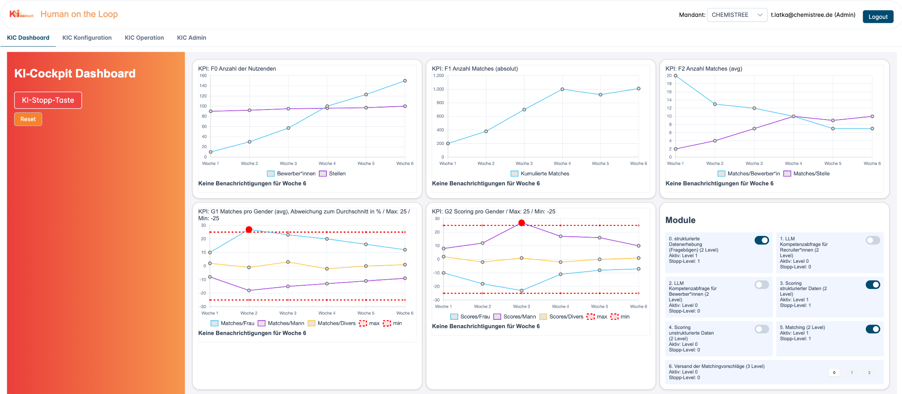

# KI-Cockpit "Human on the Loop" Konfigurationsanleitung

- [KI-Cockpit "Human on the Loop" Konfigurationsanleitung](#ki-cockpit-human-on-the-loop-konfigurationsanleitung)
- [Voraussetzungen](#voraussetzungen)
- [Anlegen eines neuen Systems mithilfe eines Admins](#anlegen-eines-neuen-systems-mithilfe-eines-admins)
- [Module anlegen](#module-anlegen)
  - [Anlage von Modulen](#anlage-von-modulen)
  - [Autonomiestufen anlegen](#autonomiestufen-anlegen)
  - [Aktuelle Autonomiestufe und Stopp-Stufe pro Modul](#aktuelle-autonomiestufe-und-stopp-stufe-pro-modul)
  - [API-Konfiguration](#api-konfiguration)
- [Risiken anlegen](#risiken-anlegen)
  - [Risiken aus Risikopool auswählen](#risiken-aus-risikopool-auswählen)
- [Verknüpfung von Risiken und Modulen](#verknüpfung-von-risiken-und-modulen)
  - [Verknüpfung von Modulen mit Risiken](#verknüpfung-von-modulen-mit-risiken)
  - [Verknüpfung von Risiken mit Modulen](#verknüpfung-von-risiken-mit-modulen)
- [Anlegen von Maßnahmen](#anlegen-von-maßnahmen)
- [Key Performance Indikatoren (KPIs)](#key-performance-indikatoren-kpis)
- [Testfälle](#testfälle)
- [Regeln](#regeln)
- [Sonstige Maßnahmen](#sonstige-maßnahmen)
- [Risikomanagement](#risikomanagement)
- [Dashboard](#dashboard)

# Voraussetzungen

Wir gehen im folgenden davon aus:

- das KI-Cockpit ist erfolgreich installiert, dass eine Kommunikation mit dem Appwrite Backend stattfindet
- d.h. es existiert ein User mit dem man sich einloggen kann

# Anlegen eines neuen Systems mithilfe eines Admins

Das KI-Cockpit ist mandantenfähig, d.h. man kann zwischen mehreren Systemen hin- und herwechseln, und muss dafür das Cockpit nicht mehrfach installieren.
Um das Cockpit zu betreiben, muss es mindestens ein System geben, welches unter "KIC Admin" angelegt werden kann.
Neue Systeme können nur von Usern mit "Globalen Adminstrator-Rechten" angelegt werden. Es muss also ein User mit diesen Rechten existieren. Dazu ist es erforderlich, die Mailadresse des Users in der Datei ".env" zu benennen, der als globaler Administrator fungieren soll.
Nur wenn sie globaler Administrator sind, sehen sie daher bei "KIC Admin" die Option "Create New".
Für die weiteren Schritte: Stellen Sie sicher, dass das System in der DropDown-Box im TopMenu ausgewählt ist.

# Module anlegen

Ist ein System angelegt und ausgewählt, beginnt die Aufgabe mehere Module des Systems anzulegen. Diese kann (zukünftig vollaumatisch) mit der API geschehen oder manuell. Im folgendenden ist zunächst der manuelle Weg beschrieben.

## Anlage von Modulen

Öffnen sie unter "KIC Konfiguration / Module" und klicken Sie auf "Create New" um neue Module anzulegen. Jedes Modul sollte zumindest einen Namen und eine Beschreibung haben.

## Autonomiestufen anlegen

Ist ein Modul abgespeichert, können auch Autonomistufen hinzugefügt werden. Eine Autonomiestufe beschreibt den Betriebsmodus eines Moduls, d.h. im einfachesten Fall "an"  oder "aus". Jede Autonomiestufe hat folgende Attribute:

- Stufe: Eine Zahl, zwischen 0 - 10. Je niedriger die Zahl, desto weniger autonom wird das Modul betrieben. Üblicherweise ist die Stufe 0 für den Zustand "aus" reserviert.
- Name: Jeder Autonomiestufe sollte einen Namen haben, wie z.B. "halbautomatisch", "vollautomatisch".
- Beschreibung: Hier kann die Autonomiestufe noch sprechender beschrieben werden.

## Aktuelle Autonomiestufe und Stopp-Stufe pro Modul

Sind alle Autonomiestufen pro Modul angelegt, dann lässt sich pro Modul im Feld "Aktuelle Stufe" auch die aktuelle Stufe des Moduls manuell anlegen, d.h. die Verwendung der Zahl, welche an der Autonomiestufe als Stufe definiert ist.

Zudem lässt sich festlegen, auf welche Autonomiestufe gewechselt werden soll, wenn die Stopp-Taste für das gesamte System gedrückt wird. Diese Stufe lässt sich über das Attribute "Autonomiestufe bei Stopptaste" definieren.

## API-Konfiguration

Unter dem Tab "API-Konfig" lässt sich pro Modul die API-Endpunkte definieren, die angesprochen werden, wenn ein Modul ausgelesen werden soll oder die Autonomiestufe eines Moduls geländert werden soll.

Grundsätzlich ist es möglich, mit dem Feld "API-Endpunkt" pro Modul einen API-Endpunkt einzugeben, über den die gesamte Kommunikation für dieses Modul geschieht. Für besondere Fälle wie z.B. für Tests lässt sich aber auch explizit ein gesonderter API-Endpunkt definieren, der nur für Änderung der  Autonomiestufen verwendet wird. Auch lässt sich mit "API-Modus" einstellen, ob überhaupt ein Request gesendet werden soll, oder nocht nicht, weil die Konfiguration noch nicht abgeschlossen ist.

# Risiken anlegen

Das KI-Cockpit ebenso wie der EU AI-Act verfolgen einen risikobasierten Ansatz. D.h. zu aller erst muss man sich am besten mit anderen im Team Gedanken machen, welche möglichen Risiken es bei dem Einsatz des KI-Systems gibt. Dieser Prozess ist ein dialogischer und kann nicht alleine durch technische Machbarkeit oder Messbarkeit begrenzt sein. Daher ist es wichtig, hier in einem moderierten Prozess Ängste und Befürchtungen ebenso zu Wort kommen zu lassen, wie Changen und Potentiale. Wenn dieser Findungsprozess beendet ist, können diese Risiken auch im KI-Cockpit eingetragen werden.

## Risiken aus Risikopool auswählen

Da für viele unklar ist, welche mögliche Risken es für KI-Systeme gibt, ist ein Risikopool installiert, der es ermöglicht existierende KI-Risikopools zu importieren und aus diesen dann die relevantesten für das eigene System zu übernehmen. Der Risikopool selbst ist nur lesbar und kann nur von Administratoren geändert werden.

# Verknüpfung von Risiken und Modulen

Sind sowohl Risiken als auch Module angelegt, lassen sich diese miteinander verknüpfen.

## Verknüpfung von Modulen mit Risiken

Unter einem Modul können sie bei dem Tab "Risiken", diejenigen Risiken markieren, die für dieses Modul besonders relevant sind. Hier genügt ein Klick um es zu aktivieren oder zu deaktivieren.

## Verknüpfung von Risiken mit Modulen

Ebenso können sie bei einem Risiko unter dem Tab "Module" diejenigen Module auswählen, wo dieses Risko besteht oder entstehen kann.

# Anlegen von Maßnahmen

Unter "Maßnahmen" bzw. engl. "Measures" sind im folgende alle Möglichkeiten gefasst, wie man existierende Risiken beobachten, reduzieren oder eleminieren kann. Wir unterscheiden folgende Typen von Maßnahmen:

# Key Performance Indikatoren (KPIs)

Ob ein Risikofall eingetreten ist oder nicht, dazu braucht es aussagegräftige Werte über das KI-System. Dazu ist der Maßnahmentyp "Key Performance Indikatoren" oder kurz KPI vorhanden. Hier lassen sich bliebige Werte aus dem KI-System auslesen, wenn es dafür im KI-System entsprechende API-Endpunkte gibt, welche diese Daten gemäß API-Definition liefern können.

KPIs lassen sich einzelnen Modulen zuordnen, um deutlich zu machen, welche Module hier gemessen werden.

Es lassen sich obere und untere Grenzwerte definieren, welche bei Über- oder Unterschreitung Alarme generieren.

Über Chart-Config kann pro KPI der passende API-Endpunkt definiert werden, wo diese KPIs ausgelesen werden sollen.

# Testfälle

Testfälle sind eine Möglichkeit, wie man ein KI-System bei definierem Input auf erwarteten Output hin überprüfen kann. Auch wenn es spezifische Besonderheiten bei dem Testen von KI-Module bestehen, so soll immer überprüft werden, inwiefern hier automatische Tests Sinn machen können, um Aussagen über ein regelkonformen Betrieb treffen zu können. Die Testfälle sind prototypisch implementiert. Die Endpunkt werden zukünftig in die KIC-API mit aufgenommen.

# Regeln

Regeln sollen es erlauben, dass in definiertem Zeiträumen automatische Aktionen gestartet werden können, wie Testfälle, KPI-Checks etc. Diese zeitbasierte Logik soll später weiter ausgebaut werden, momentan dient sie als Prototyp um zu zeigen, welche Aktionen man in Zukunft regelbasiert ausführen können möchte.

Eine wichtige Regel-Ausführung kann sein, dass bei bestimmten Bedingungen Autonomiestufen von Module automatisch geändert werden.

# Sonstige Maßnahmen

Alle Maßnahmen, die über KPIs, Testfälle und Regeln hinaus gehen, werden als sonstige Maßnahmen beschrieben. Für ein Risikomanagement ist es wichtig, dass auch nicht-technische Maßnahmen hier erfasst werden, um damit zu dokumentieren, dass man alle Möglichkeiten genutzt hat, um Risiken zu minimeren.

# Risikomanagement

Im Menüpunkt "Risikomanagement" erfolgt nun die Zuordnung zwischen einem Risiko und einer Maßnahme auf eine besondere Art. Denn es lässt sich feingranular einstellen, auf welcher Art ein bestehendes Risiko durch eine Maßnahme bearbeitet wird. Prototypisch gibt es drei Typen: Risiken können durch Maßnahmen beobachtet, reduziert oder eliminiert werden.
Dazu ist pro Risiko und Maßnahmne ein Eintrag im Risikomanagement nötig, der genau diesen Typ beschreibt.

# Dashboard

Das Dashboard erfüllt folgende Funktionen:

- Anzeige von Charts für die KPIs.
- Übersicht aller Module mit aktiver Autonomiestufe, Stopp-Stufe und Möglichkeit, die Autonomiestufe zu wechseln
- Stopp-Taste: Erlaubt den automatischen Wechsel von allen Module in die als Stopp-Level definierte Autonomiestufe, um einen sicheres Runterfahren gemäß AI-Act zu gewährleisten.
